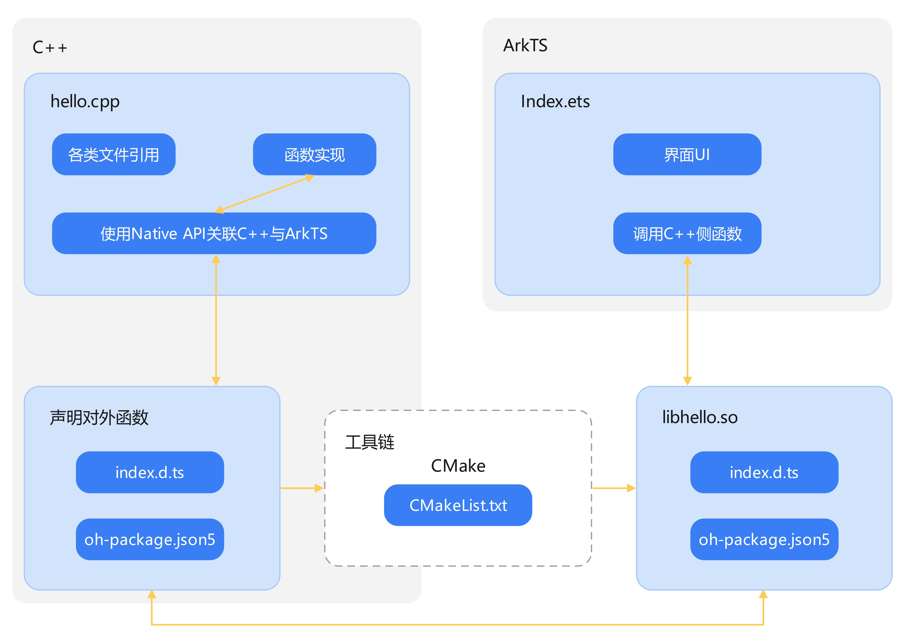
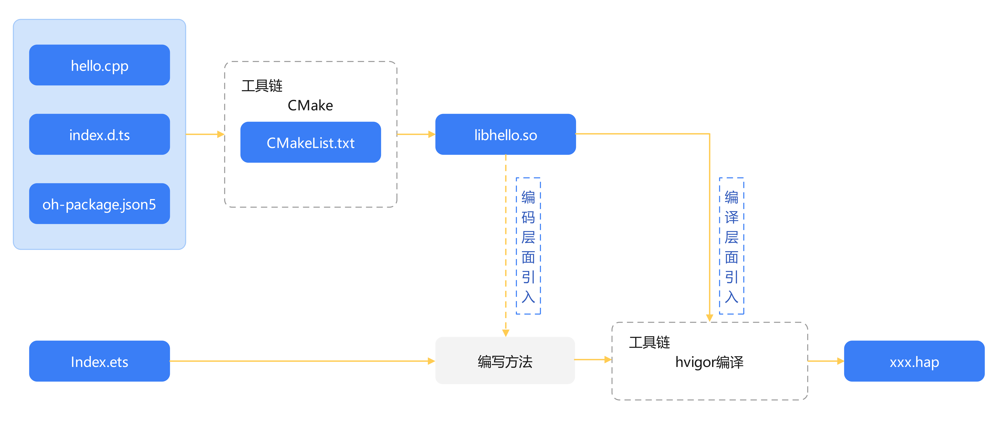

## 介绍

使用C标准库hypot接口计算两个给定数平方和的平方根。在输入框中输入两个数字，点击计算结果按钮显示计算后的数值。

### 相关概念

- [NAPI](https://developer.harmonyos.com/cn/docs/documentation/doc-guides-V3/napi-guidelines-0000001493903956-V3?catalogVersion=V3)：NAPI提供的接口名与三方Node.js一致，目前支持部分接口。
- [NAPI中支持的标准库](https://developer.harmonyos.com/cn/docs/documentation/doc-references-V3/musl-0000001478181805-V3)：目前支持标准C库、C++库、OpenSL ES、zlib。


## 代码结构解读

```
├──entry/src/main
│  ├──common      
│  │  └──CommonContants.ets            // 常量定义文件
│  ├──cpp                              // C++代码区
│  │  ├──CMakeLists.txt                // CMake编译配置文件
│  │  ├──hello.cpp                     // C++源代码
│  │  └──types                         // 接口存放文件夹
│  │     └──libhello
│  │        ├──index.d.ts              // 接口文件
│  │        └──oh-package.json5        // 接口注册配置文件
│  └──ets                              // 代码区
│     ├──entryability
│     │  └──EntryAbility.ts            // 程序入口类
│     └──pages
│        └──Index.ets                  // 主界面
└──entry/src/main/resources            // 资源文件目录
```

使用Native C++模板创建项目会自动生成cpp文件夹、types文件夹、CMakeList.txt文件，开发者可以根据实际情况自行添加修改其他文件及文件夹。


## 架构组成

### 应用架构



应用架构可以分为三部分：C++、ArkTS、工具链。

- C++：包含各种文件的引用、C++或者C代码、Native项目必需的配置文件等。
- ArkTS：包含界面UI、自身方法、调用引用包的方法等。
- 工具链：包含CMake编译工具在内的系列工具。

使用ArkTS调用C++方法的过程中，需要使用到NAPI、CMake等工具来做中间转换，架构及其关联关系参考示意图。

示意图中，hello.cpp文件实现C++方法，并通过NAPI将C++方法与ArkTS方法关联。

C++代码通过CMake编译工具编译成动态链接库so文件，使用index.d.ts文件对外提供接口。ArkTS引入so文件后调用其中的接口。


### 编译架构



ArkTS与C++方法的调用、编译流程参考示意图。C++代码通过CMake编译生成so文件后可以直接被ArkTS侧引入，最终通过hvigor编译成可执行的hap包。


## Native项目开发流程

### Native侧实现

```c++
// hello.cpp
#include <hilog/log.h>
#include "napi/native_api.h"
#include "math.h"
#include "./common/common.h"

static napi_value MyHypot(napi_env env, napi_callback_info info)
{
    if ((nullptr == env) || (nullptr == info)) {
        OH_LOG_Print(LOG_APP, LOG_ERROR, LOG_PRINT_DOMAIN, "MyHypot", "env or exports is null");
        return nullptr;
    }

    // Number of parameters.
    size_t argc = PARAMETER_COUNT;

    // Declare parameter array.
    napi_value args[PARAMETER_COUNT] = { nullptr };

    // Gets the arguments passed in and puts them in the argument array.
    if (napi_ok != napi_get_cb_info(env, info, &argc, args, nullptr, nullptr)) {
        OH_LOG_Print(LOG_APP, LOG_ERROR, LOG_PRINT_DOMAIN, "MyHypot", "api_get_cb_info failed");
        return nullptr;
    }

    // Converts arguments passed in to type double.
    double valueX = 0.0;
    double valueY = 0.0;
    if (napi_ok != napi_get_value_double(env, args[0], &valueX) ||
        napi_ok != napi_get_value_double(env, args[1], &valueY)) {
        OH_LOG_Print(LOG_APP, LOG_ERROR, LOG_PRINT_DOMAIN, "MyHypot", "napi_get_value_double failed");
        return nullptr;
    }

    // The hypot method of the C standard library is called to perform the calculation.
    double result = hypot(valueX, valueY);

    napi_value napiResult;
    if (napi_ok != napi_create_double(env, result, &napiResult)) {
        OH_LOG_Print(LOG_APP, LOG_ERROR, LOG_PRINT_DOMAIN, "MyHypot", "napi_create_double failed");
        return nullptr;
    }
    return napiResult;
}

EXTERN_C_START
static napi_value Init(napi_env env, napi_value exports)
{
    if ((nullptr == env) || (nullptr == exports)) {
        OH_LOG_Print(LOG_APP, LOG_ERROR, LOG_PRINT_DOMAIN, "Init", "env or exports is null");
        return exports;
    }

    napi_property_descriptor desc[] = {
        { "myHypot", nullptr, MyHypot, nullptr, nullptr, nullptr, napi_default, nullptr }
    };
    if (napi_ok != napi_define_properties(env, exports, sizeof(desc) / sizeof(desc[0]), desc)) {
        OH_LOG_Print(LOG_APP, LOG_ERROR, LOG_PRINT_DOMAIN, "Init", "napi_define_properties failed");
        return nullptr;
    }
    return exports;
}
EXTERN_C_END

static napi_module demoModule = {
    .nm_version = 1,
    .nm_flags = 0,
    .nm_filename = nullptr,
    .nm_register_func = Init,
    .nm_modname = "hello",
    .nm_priv = ((void *)0),
    .reserved = { 0 }
};

extern "C" __attribute__((constructor)) void RegisterModule(void)
{
    napi_module_register(&demoModule);
}
```

配置模块描述信息，设置Init方法为napi_module的入口方法。__attribute__((constructor))修饰的方法由系统自动调用，使用Native API接口napi_module_register()传入模块描述信息进行模块注册。

Native C++模板创建项目会自动生成此结构代码，开发者可根据实际情况修改其中内容。

- Init方法为Native C++模板生成的结构，开发者可根据实际情况修改其中内容。
- 在napi_property_descriptor desc[]中，我们需要将编写的MyHypot方法与对外提供的接口myHypot接口进行关联，其他参数使用示例默认值填写。
- 使用Native API接口napi_define_properties构建包含方法对应列表的返回值。

本例中使用C标准库的hypot方法进行计算。引入C标准库头文件math.h，使用double类型解析传入的参数后，调用C标准库方法hypot计算两数平方的和后计算平方根。使用NAPI接口napi_create_double将结果转化为napi_value类型的变量并返回。

```javascript
// index.d.ts
export const myHypot: (a: number, b: number) => number;

// oh-package.json5
{
  "name": "libhello.so",
  "types": "./index.d.ts"
}

// entry/oh-package.json5
{
  "devDependencies": {
    "@types/libhello.so": "file:./src/main/cpp/types/libhello"
  }
}
```

添加接口文件以及接口配置文件。接口文件index.d.ts用于对外提供方法说明。接口配置文件oh-package.json5文件中将index.d.ts与CMake编译的so文件关联起来。模块级目录下oh-package.json5文件添加so文件依赖。

```cmake
# CMakeLists.txt
# 声明使用 CMAKE 的最小版本号
cmake_minimum_required(VERSION 3.4.1)

# 配置项目信息
project(NativeTemplateDemo)

# set命令，格式为set(key value)，表示设置key的值为value
set(NATIVERENDER_ROOT_PATH ${CMAKE_CURRENT_SOURCE_DIR})

# 设置头文件的搜索目录
include_directories(
    ${NATIVERENDER_ROOT_PATH}
    ${NATIVERENDER_ROOT_PATH}/include
)

# 添加日志库
find_library(
    # Sets the name of the path variable.
    hilog-lib
    # Specifies the name of the NDK library that
    # you want CMake to locate.
    hilog_ndk.z
)

# 添加名为hello的库，库文件名为libhello.so
add_library(hello SHARED hello.cpp)

# 添加构建需要链接的库
target_link_libraries(hello PUBLIC ${hilog-lib} libace_napi.z.so libc++.a)
```

在CMakeLists.txt文件中配置CMake编译参数。配置需要添加的hello.cpp文件，编译后的so文件名为libhello.so。CMakeLists.txt是CMake编译的配置文件，里面的大部分内容无需修改，project、add_library方法中的内容可以根据实际情况修改。

> CMAKE_CURRENT_SOURCE_DIR：CMakeList.txt文件所在的目录。 add_library：添加本地的cpp文件，多cpp文件使用空格或换行间隔。 target_link_libraries：添加需要链接的库，本篇Codelab使用C标准库hypot函数，此处链接libc++.a库文件。


### ArkTS调用C++方法

```javascript
// Index.ets
import libHello from 'libhello.so';

@Entry
@Component
struct Index {
  ...
  build() {
    ...
    Button($r('app.string.submit_button')) 
      .onClick(() => { 
        let resultTemp = libHello.myHypot(this.numX, this.numY);
        if (resultTemp > CommonContants.MAX_RESULT) {
          this.result = resultTemp.toExponential(CommonContants.EXPONENTIAL_COUNT);
        } else {
          this.result = resultTemp.toFixed(CommonContants.FIXED_COUNT);
        }
      })
  }
}
```

Index.ets文件使用import语句导入CMake编译出的so文件。Button组件添加点击事件，点击按钮触发点击事件时，调用libhello.so对外提供的myHypot方法，执行计算并返回计算结果。依据结果值进行格式化，显示科学计数法或保留指定位小数。


### 界面设计

```javascript
// Index.ets
@Entry
@Component
struct NativeTemplate {
  ...
  build() {
    Column() {
      ...
      Column() {
        ...
        Row() {
          ...
          TextInput({ controller: this.textInputControllerX })
            .type(InputType.Number)
        }
        .height($r('app.float.tips_num_height'))
        .width(CommonContants.FULL_PARENT)
        Row() {
          ...
          TextInput({ controller: this.textInputControllerY })
            .type(InputType.Number)
        }
        .height($r('app.float.tips_num_height'))
        .width(CommonContants.FULL_PARENT)
      }
      Row() {
        Button($r('app.string.submit_button'))
          .height(CommonContants.FULL_PARENT)
          .width($r('app.float.button_width'))
      }
      .height($r('app.float.button_height'))
      .width(CommonContants.FULL_PARENT)
    }
    .width(CommonContants.FULL_PARENT)
    .height(CommonContants.FULL_PARENT)
  }
}
```

界面由标题、文本说明、计算结果展示、输入框、按钮组成。Index.ets文件完成界面实现，使用Column及Row容器组件进行布局。
